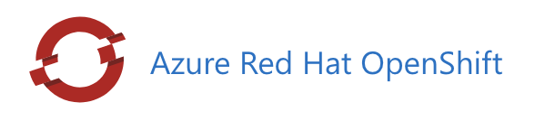

# DAPR, KEDA on ARO (Azure RedHat OpenShift): step by step

You can see the original article about [DAPR, KEDA on AKS: step by step](https://github.com/diegodocs/dapr-keda-go/blob/main/articles/dapr-keda-aks-en-us.md)

In this article, we going to focus to setup DAPR, KEDA on ARO (Azure RedHat OpenShift):

- Go - Producer/Consumer App
- Distributed Application Runtime - DAPR
- Kubernetes Event Driven Autoscaling - KEDA
- Azure RedHat OpenShift (ARO)
- Azure Container Registry (ACR)




## Development Tools

- [Go SDK](https://go.dev/dl/)
- [Azure CLI](https://learn.microsoft.com/pt-br/cli/azure/install-azure-cli)
- [OpenShift CLI](https://docs.openshift.com/container-platform/4.11/cli_reference/openshift_cli/getting-started-cli.html)
- [DAPR CLI](https://docs.dapr.io/getting-started/install-dapr-cli/)
- [Kubectl](https://kubernetes.io/pt-br/docs/tasks/tools/)
- [Helm CLI](https://github.com/helm/helm)
- [GIT bash](https://git-scm.com/downloads)
- [Visual Studio Code](https://code.visualstudio.com/download)

## Deploying Infrastructure

- [click here for complete step-by-step](https://github.com/diegodocs/dapr-keda-go/docs/setup-infra.md)

Login to Azure using the CLI:

```powershell
az login
```

Replace follow texts with correct values based on your environment:

```powershell
- $SubscriptionID = ''
- $Location = ''
- $ResourceGroupName = ''
- $ClusterName = ''
- $ContainerRegistryName = ''
- $ServiceBusNamespace = ''
```

Set the default subscription:

```powershell
az account set --subscription $SubscriptionID
```

Create a resource group:

```powershell
az group create --name $ResourceGroupName --location $Location
```

### Setup Network

Create virtual network

```powershell
az network vnet create --address-prefixes 10.0.0.0/22 --name "$ClusterName-vnet" --resource-group $ResourceGroupName
```

Create control plane subnet

```powershell
az network vnet subnet create --resource-group $ResourceGroupName --vnet-name "$ClusterName-vnet" --name "$ClusterName-control-plane-subnet" --address-prefixes 10.0.0.0/23
```

Create workers subnet

```powershell
az network vnet subnet create --resource-group $ResourceGroupName --vnet-name "$ClusterName-vnet" --name "$ClusterName-worker-subnet" --address-prefixes 10.0.2.0/23
```

Disable network policies for Private Link Service on the control plane subnet

```powershell
az network vnet subnet update --name "$ClusterName-control-plane-subnet" --resource-group $ResourceGroupName --vnet-name "$ClusterName-vnet" --disable-private-link-service-network-policies true
```

### Create an ARO cluster and attach ACR

Create an ARO cluster:

```powershell
az aro create --resource-group $ResourceGroupName --name $ClusterName --vnet "$ClusterName-vnet" --master-subnet "$ClusterName-control-plane-subnet" --worker-subnet "$ClusterName-worker-subnet"
```

Create a Container Registry:

```powershell
az acr create --name $ContainerRegistryName --resource-group $ResourceGroupName --sku basic
```

Attach the Container Registry to ARO:

```powershell
az acr credential show -n $ContainerRegistryName

oc create secret docker-registry --docker-server=$ContainerRegistryName.azurecr.io --docker-username=<user name> --docker-password=<your password>--docker-email=unused acr-secret

oc secrets link default <pull_secret_name> --for=pull
```

Get OpenShift console URL

```powershell
az aro show --name $ClusterName --resource-group $ResourceGroupName -o tsv --query consoleProfile
```

Get OpenShift credentials:

```powershell
az aro list-credentials --name $ClusterName --resource-group $ResourceGroupName -o tsv
```

Verify the connection to the cluster:

```powershell
kubectl cluster-info
```

### Setup DAPR on ARO

Add a reference:

```powershell
helm repo add dapr https://dapr.github.io/helm-charts/   
helm repo update
helm upgrade --install dapr dapr/dapr --namespace dapr-system --create-namespace
helm upgrade --install dapr-dashboard dapr/dapr-dashboard --namespace dapr-system --create-namespace
```

Verify if pods are running:

```powershell
kubectl get pods -n dapr-system
```

### DAPR Dashboard

#### To access the DAPR dashboard, run the following command

```powershell
dapr dashboard -k
```

**Expected response:**

```powershell
DAPR dashboard found in namespace: dapr-system
DAPR dashboard available at http://localhost:8080
```

### 3. Add KEDA to ARO

Add a reference :

```powershell
helm repo add kedacore https://kedacore.github.io/charts
helm repo update
helm upgrade --install keda kedacore/keda -n keda-system --create-namespace
helm upgrade --install keda-add-ons-http kedacore/keda-add-ons-http -n keda-system --create-namespace
 
```

Verify if pods are running:

```powershell
kubectl get pods -n keda-system
```

### Setup Transport Layer with DAPR and KEDA

In this project, we have three different options to configure the transport layer (choose one):

- [Azure Service Bus](https://github.com/diegodocs/dapr-keda-go/setup-infra-azsbus.md)
- [Redis](https://github.com/diegodocs/dapr-keda-go/setup-infra-redis.md)
- [RabbitMq](https://github.com/diegodocs/dapr-keda-go/setup-infra-rbmq.md)

## Deploy applications to ARO

### Building images

```powershell
az acr login --name $ContainerRegistryName
docker build -t "$ContainerRegistryName.azurecr.io/consumer-app:1.0.0" -f cmd/consumer/dockerfile .
docker build -t "$ContainerRegistryName.azurecr.io/producer-app:1.0.0" -f cmd/producer/dockerfile .
```

### Pushing images to ACR

```powershell

docker push "$ContainerRegistryName.azurecr.io/consumer-app:1.0.0" 
docker push "$ContainerRegistryName.azurecr.io/producer-app:1.0.0" 
```

### Setup DAPR and KEDA Dependencies

```powershell
helm upgrade --install app .helmcharts/app -n tree --create-namespace
```

Verify if pods are running:

```powershell
kubectl get pods -n tree
```

### 4. Testing the application

```powershell
# Reviewing Logs
kubectl logs -f -l app=consumer1 --all-containers=true -n tree

# Create a port
kubectl port-forward pod/producer1 8081 8081 -n tree

# Send post to producer app
- POST -> http://localhost:8081/plant
- Json Body: {"numberOfTrees":100}

# Review pod instances and status
kubectl get pod -l app=consumer1 -n tree
```

### Clean-up

Follow these steps to remove all the apps, components and cloud resources created in this how-to guide.

```powershell
helm uninstall app -n tree
```

```powershell
helm uninstall keda-add-ons-http -n keda-system
helm uninstall keda -n keda-system
helm uninstall dapr -n dapr-system
```

Delete all Azure resources:

```powershell
az aro delete --resource-group $ResourceGroupName --name $ClusterName
az acr delete --resource-group $ResourceGroupName --name $ContainerRegistryName
az group delete --name $ResourceGroupName
```

## References

- [DAPR KEDA GO Project](https://github.com/diegodocs/dapr-keda-go)
- [DAPR - Pros/Cons](https://github.com/diegodocs/dapr-keda-go/docs/dapr-pros-cons.md)
- [KEDA  - Pros/Cons](https://github.com/diegodocs/dapr-keda-go/docs/keda-pros-cons.md)
